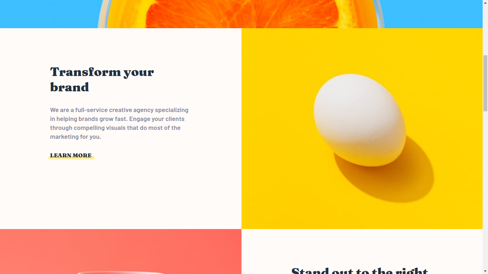

# Frontend Mentor - Sunnyside agency landing page solution

This is a solution to the [Sunnyside agency landing page challenge on Frontend Mentor](https://www.frontendmentor.io/challenges/sunnyside-agency-landing-page-7yVs3B6ef). Frontend Mentor challenges help you improve your coding skills by building realistic projects.

## Table of contents

- [Overview](#overview)
  - [The challenge](#the-challenge)
  - [Screenshot](#screenshot)
  - [Links](#links)
- [My process](#my-process)
  - [Built with](#built-with)
  - [What I learned](#what-i-learned)
- [Author](#author)

## Overview

### The challenge

Users should be able to:

- View the optimal layout for the site depending on their device's screen size
- See hover states for all interactive elements on the page

### Screenshot

### Links

- Live Site URL: [Add live site URL here](https://emersonhenriquedev.github.io/sunnyside-agency/)

## My process

### Built with

- Semantic HTML5 markup
- CSS custom properties
- BEM methodology
- SASS
- Flexbox
- Mobile-first workflow
- Javascript

### What I learned
I improved my css skills with flexbox, mobile first, animations, BEM methodology and SASS technology. And also I practiced a little of javascript for menu mobile solution.

## Author

- Frontend Mentor - [@emersonhenriquedev](https://www.frontendmentor.io/profile/emersonhenriquedev)
- Linkedin - [linkedin](https://www.linkedin.com/in/emerson-henrique-macedo-9397a2186/)
